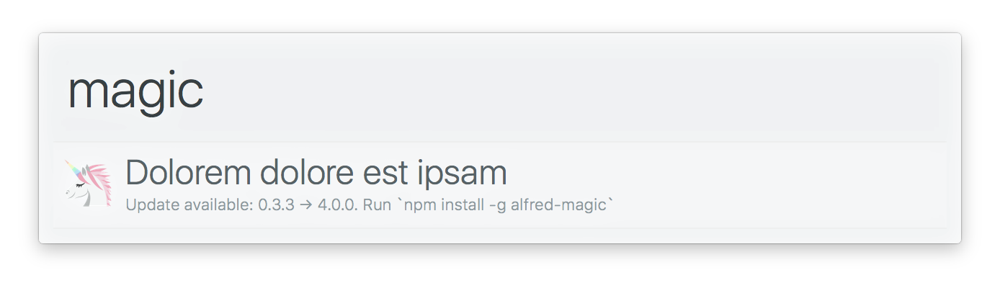

# 

> Create [Alfred workflows](https://www.alfredapp.com/workflows/) with ease

[](https://travis-ci.org/sindresorhus/alfy)


## Highlights

- Easy input↔output.
- Config and [cache](#caching) handling built-in.
- Fetching remote files with optional caching.
- Publish your workflow to npm.
- Automatic [update notifications](#update-notifications).
- Easily [testable workflows](#testing).
- [Finds the `node` binary.](run-node.sh)
- Support for top-level `await`.
- Presents uncaught exceptions and unhandled Promise rejections to the user.<br>
  *No need to manually `.catch()` top-level promises.*


## Prerequisites

You need [Node.js 8+](https://nodejs.org) and [Alfred 3 or 4](https://www.alfredapp.com) with the paid [Powerpack](https://www.alfredapp.com/powerpack/) upgrade.


## Install

```
$ npm install alfy
```

## Usage

1. Create a new blank Alfred workflow.

2. Add a `Script Filter` (right-click the canvas → `Inputs` → `Script Filter`), set `Language` to `/bin/bash`, and add the following script:

```
./node_modules/.bin/run-node index.js "$1"
```

*We can't call `node` directly as GUI apps on macOS doesn't inherit the $PATH.*

> Tip: You can use [generator-alfred](https://github.com/SamVerschueren/generator-alfred) to scaffold out an `alfy` based workflow. If so, you can skip the rest of the steps, go straight to the `index.js` and do your thing.

3. Set the `Keyword` by which you want to invoke your workflow.

4. Go to your new workflow directory (right-click on the workflow in the sidebar → `Open in Finder`).

5. Initialize a repo with `npm init`.

6. Install Alfy with `npm install alfy`.

7. In the workflow directory, create a `index.js` file, import `alfy`, and do your thing.


## Example

Here we fetch some JSON from a placeholder API and present matching items to the user:

```js
const alfy = require('alfy');

const data = await alfy.fetch('https://jsonplaceholder.typicode.com/posts');

const items = alfy
	.inputMatches(data, 'title')
	.map(element => ({
		title: element.title,
		subtitle: element.body,
		arg: element.id
	}));

alfy.output(items);
```


###### More

Some example usage in the wild: [`alfred-npms`](https://github.com/sindresorhus/alfred-npms), [`alfred-emoj`](https://github.com/sindresorhus/alfred-emoj), [`alfred-ng`](https://github.com/SamVerschueren/alfred-ng).


## Update notifications

Alfy uses [alfred-notifier](https://github.com/SamVerschueren/alfred-notifier) in the background to show a notification when an update for your workflow is available.




## Caching

Alfy offers the possibility of caching data, either with the [fetch](#fetchurl-options) or directly through the [cache](#cache) object.

An important thing to note is that the cached data gets invalidated automatically when you update your workflow. This offers the flexibility for developers to change the structure of the cached data between workflows without having to worry about invalid older data.


## Publish to npm

By adding `alfy-init` as `postinstall` and `alfy-cleanup` as `preuninstall` script, you can publish your package to [npm](https://npmjs.org) instead of to [Packal](http://www.packal.org). This way, your packages are only one simple `npm install` command away.

```json
{
	"name": "alfred-unicorn",
	"version": "1.0.0",
	"description": "My awesome unicorn workflow",
	"author": {
		"name": "Sindre Sorhus",
		"email": "sindresorhus@gmail.com",
		"url": "sindresorhus.com"
	},
	"scripts": {
		"postinstall": "alfy-init",
		"preuninstall": "alfy-cleanup"
	},
	"dependencies": {
		"alfy": "*"
	}
}
```

> Tip: Prefix your workflow with `alfred-` to make them easy searchable through npm.

You can remove [these](https://github.com/samverschueren/alfred-link#infoplist) properties from your `info.plist` file as they are being added automatically at install time.

After publishing your workflow to npm, your users can easily install or update the workflow.

```
$ npm install --global alfred-unicorn
```

> Tip: instead of manually updating every workflow yourself, use the [alfred-updater](https://github.com/SamVerschueren/alfred-updater) workflow to do that for you.


## Testing

Workflows can easily be tested with [alfy-test](https://github.com/SamVerschueren/alfy-test). Here is a small example.

```js
import test from 'ava';
import alfyTest from 'alfy-test';

test('main', async t => {
	const alfy = alfyTest();

	const result = await alfy('workflow input');

	t.deepEqual(result, [
		{
			title: 'foo',
			subtitle: 'bar'
		}
	]);
});
```


## Debugging

When developing your workflow it can be useful to be able to debug it when something is not working. This is when the [workflow debugger](https://www.alfredapp.com/help/workflows/advanced/debugger/) comes in handy. You can find it in your workflow view in Alfred. Press the insect icon to open it. It will show you the plain text output of `alfy.output()` and anything you log with `alfy.log()`:

```js
const unicorn = getUnicorn();
alfy.log(unicorn);
```

## Environment variables

Alfred lets users set [environment variables for a workflow](https://www.alfredapp.com/help/workflows/advanced/variables/) which can then be used by that workflow. This can be useful if you, for example, need the user to specify an API token for a service. You can access the workflow environment variables from [`process.env`](https://nodejs.org/api/process.html#process_process_env). For example `process.env.apiToken`.


## API

### alfy

#### input

Type: `string`

Input from Alfred. What the user wrote in the input box.

#### output(list)

Return output to Alfred.

##### list

Type: `object[]`

List of `object` with any of the [supported properties](https://www.alfredapp.com/help/workflows/inputs/script-filter/json/).

Example:

```js
alfy.output([
	{
		title: 'Unicorn'
	},
	{
		title: 'Rainbow'
	}
]);
```


#### log(value)

Log `value` to the [Alfred workflow debugger](https://www.alfredapp.com/help/workflows/advanced/debugger/).

#### matches(input, list, item?)

Returns an `string[]` of items in `list` that case-insensitively contains `input`.

```js
alfy.matches('Corn', ['foo', 'unicorn']);
//=> ['unicorn']
```

##### input

Type: `string`

Text to match against the `list` items.

##### list

Type: `string[]`

List to be matched against.

##### item

Type: `string | Function`

By default, it will match against the `list` items.

Specify a string to match against an object property:

```js
const list = [
	{
		title: 'foo'
	},
	{
		title: 'unicorn'
	}
];

alfy.matches('Unicorn', list, 'title');
//=> [{title: 'unicorn'}]
```

Or [nested property](https://github.com/sindresorhus/dot-prop):

```js
const list = [
	{
		name: {
			first: 'John',
			last: 'Doe'
		}
	},
	{
		name: {
			first: 'Sindre',
			last: 'Sorhus'
		}
	}
];

alfy.matches('sindre', list, 'name.first');
//=> [{name: {first: 'Sindre', last: 'Sorhus'}}]
```

Specify a function to handle the matching yourself. The function receives the list item and input, both lowercased, as arguments, and is expected to return a boolean of whether it matches:

```js
const list = ['foo', 'unicorn'];

// Here we do an exact match.
// `Foo` matches the item since it's lowercased for you.
alfy.matches('Foo', list, (item, input) => item === input);
//=> ['foo']
```

#### inputMatches(list, item?)

Same as `matches()`, but with `alfy.input` as `input`.

#### error(error)

Display an error or error message in Alfred.

**Note:** You don't need to `.catch()` top-level promises. Alfy handles that for you.

##### error

Type: `Error | string`

Error or error message to be displayed.


#### fetch(url, options?)

Returns a `Promise` that returns the body of the response.

##### url

Type: `string`

URL to fetch.

##### options

Type: `object`

Any of the [`got` options](https://github.com/sindresorhus/got#options).

###### json

Type: `boolean`<br>
Default: `true`

Parse response body with `JSON.parse` and set `accept` header to `application/json`.

###### maxAge

Type: `number`

Number of milliseconds this request should be cached.

###### transform

Type: `Function`

Transform the response before it gets cached.

```js
await alfy.fetch('https://api.foo.com', {
	transform: body => {
		body.foo = 'bar';
		return body;
	}
})
```

You can also return a Promise.

```js
const xml2js = require('xmls2js');
const pify = require('pify');

const parseString = pify(xml2js.parseString);

await alfy.fetch('https://api.foo.com', {
	transform: body => parseString(body)
})
```

#### config

Type: `object`

Persist config data.

Exports a [`conf` instance](https://github.com/sindresorhus/conf#instance) with the correct config path set.

Example:

```js
alfy.config.set('unicorn', '🦄');

alfy.config.get('unicorn');
//=> '🦄'
```

#### cache

Type: `object`

Persist cache data.

Exports a modified [`conf` instance](https://github.com/sindresorhus/conf#instance) with the correct cache path set.

Example:

```js
alfy.cache.set('unicorn', '🦄');

alfy.cache.get('unicorn');
//=> '🦄'
```

##### maxAge

The `set` method of this instance accepts an optional third argument where you can provide a `maxAge` option. `maxAge` is
the number of milliseconds the value is valid in the cache.

Example:

```js
const delay = require('delay');

alfy.cache.set('foo', 'bar', {maxAge: 5000});

alfy.cache.get('foo');
//=> 'bar'

// Wait 5 seconds
await delay(5000);

alfy.cache.get('foo');
//=> undefined
```

#### debug

Type: `boolean`

Whether the user currently has the [workflow debugger](https://www.alfredapp.com/help/workflows/advanced/debugger/) open.

#### icon

Type: `object`<br>
Keys: `info` `warning` `error` `alert` `like` `delete`

Get various default system icons.

The most useful ones are included as keys. The rest you can get with `icon.get()`. Go to `/System/Library/CoreServices/CoreTypes.bundle/Contents/Resources` in Finder to see them all.

Example:

```js
console.log(alfy.icon.error);
//=> '/System/Library/CoreServices/CoreTypes.bundle/Contents/Resources/AlertStopIcon.icns'

console.log(alfy.icon.get('Clock'));
//=> '/System/Library/CoreServices/CoreTypes.bundle/Contents/Resources/Clock.icns'
```

#### meta

Type: `object`

Example:

```js
{
	name: 'Emoj',
	version: '0.2.5',
	uid: 'user.workflow.B0AC54EC-601C-479A-9428-01F9FD732959',
	bundleId: 'com.sindresorhus.emoj'
}
```

#### alfred

Type: `object`

Alfred metadata.

##### version

Example: `'3.0.2'`

Find out which version the user is currently running. This may be useful if your workflow depends on a particular Alfred version's features.

##### theme

Example: `'alfred.theme.yosemite'`

Current theme used.

##### themeBackground

Example: `'rgba(255,255,255,0.98)'`

If you're creating icons on the fly, this allows you to find out the color of the theme background.

##### themeSelectionBackground

Example: `'rgba(255,255,255,0.98)'`

The color of the selected result.

##### themeSubtext

Example: `3`

Find out what subtext mode the user has selected in the Appearance preferences.

> Usability note: This is available so developers can tweak the result text based on the user's selected mode, but a workflow's result text should not be bloated unnecessarily based on this, as the main reason users generally hide the subtext is to make Alfred look cleaner.

##### data

Example: `'/Users/sindresorhus/Library/Application Support/Alfred/Workflow Data/com.sindresorhus.npms'`

Recommended location for non-volatile data. Just use `alfy.data` which uses this path.

##### cache

Example: `'/Users/sindresorhus/Library/Caches/com.runningwithcrayons.Alfred/Workflow Data/com.sindresorhus.npms'`

Recommended location for volatile data. Just use `alfy.cache` which uses this path.

##### preferences

Example: `'/Users/sindresorhus/Dropbox/Alfred/Alfred.alfredpreferences'`

This is the location of the `Alfred.alfredpreferences`. If a user has synced their settings, this will allow you to find out where their settings are regardless of sync state.

##### preferencesLocalHash

Example: `'adbd4f66bc3ae8493832af61a41ee609b20d8705'`

Non-synced local preferences are stored within `Alfred.alfredpreferences` under `…/preferences/local/${preferencesLocalHash}/`.


## Users

*Alfred workflows using Alfy*

- [alfred-emoj](https://github.com/sindresorhus/alfred-emoj) - Find relevant emoji from text
- [alfred-npms](https://github.com/sindresorhus/alfred-npms) - Search for npm packages with npms.io
- [alfred-dark-mode](https://github.com/sindresorhus/alfred-dark-mode) - Toggle the system dark mode
- [alfred-xcode](https://github.com/sindresorhus/alfred-xcode) - Open Xcode projects and workspaces
- [alfred-lock](https://github.com/sindresorhus/alfred-lock) - Lock your Mac
- [alfred-fkill](https://github.com/SamVerschueren/alfred-fkill) - Fabulously search and kill processes
- [alfred-ng](https://github.com/SamVerschueren/alfred-ng) - Search through the Angular documentation on angular.io
- [alfred-ionic](https://github.com/SamVerschueren/alfred-ionic) - Search through the Ionic documentation
- [alfred-react-native](https://github.com/ekonstantinidis/alfred-react-native) - Access the React Native documentation
- [alfred-hl](https://github.com/importre/alfred-hl) - Syntax highlight code in the clipboard
- [alfred-workflow-docs-elastic](https://github.com/spinscale/alfred-workflow-elastic-docs) - Search the Elastic.co documentation
- [alfredinary](https://github.com/urre/alfredinary) - Capture screenshots and upload to Cloudinary
- [alfred-keycode](https://github.com/radibit/alfred-keycode) - Get JavaScript keycodes
- [alfred-vue](https://github.com/radibit/alfred-vue) - Search the Vue.js API docs
- [alfred-meteor-docs](https://github.com/wolasss/alfred-meteor-docs) - Search the Meteor docs
- [alfred-meteor-packages](https://github.com/sasikanth513/alfred-meteor-packages) - Meteor package search
- [alfred-climbing-grades-converter](https://github.com/wolasss/alfred-climbing-grades-converter) - Convert between climbing grading systems
- [alfred-hotel](https://github.com/exah/alfred-hotel) - Quickly start, stop and open [Hotel](https://github.com/typicode/hotel) apps
- [alfred-coolors](https://github.com/radibit/alfred-coolors) - Find relevant color names
- [alfred-postico-favorites-workflow](https://github.com/payers1/alfred-postico-favorites-workflow) - Open postico favorites
- [alfred-messages](https://github.com/briangonzalez/alfred-messages) - Message your contacts through iMessage
- [alfred-bitbucket](https://github.com/nicklayb/alfred-bitbucket) - List you and your teams public and private Bitbucket repositories
- [alfred-asana](https://github.com/adriantoine/alfred-asana) - Search your Asana tasks
- [alfred-cacher](https://github.com/CacherApp/alfred-cacher) - Find a code snippet from [Cacher](https://www.cacher.io) and copy it to the clipboard
- [alfred-loremipsum](https://github.com/AntonNiklasson/alfred-loremipsum) - Generate placeholder text
- [alfred-kaomoji](https://github.com/vinkla/alfred-kaomoji) - Find relevant kaomoji from text
- [alfred-packagist](https://github.com/vinkla/alfred-packagist) - Search for PHP packages with Packagist
- [alfred-vpn](https://github.com/stve/alfred-vpn) - Connect/disconnect from VPNs
- [alfred-clap](https://github.com/jacc/alfred-clap) - 👏🏻 Clap 👏🏻 stuff 👏🏻 out 👏🏻 in 👏🏻 Alfred! 👏🏻
- [alfred-yandex-translate](https://github.com/mkalygin/alfred-yandex-translate) - Translate words and text with Yandex Translate
- [alfred-now](https://github.com/lucaperret/alfred-now) - Use [Now](https://zeit.co/now) commands within Alfred to access deployments and aliases
- [alfred-chuck-norris-jokes](https://github.com/jeppestaerk/alfred-chuck-norris-jokes) - Get Chuck Norris jokes
- [alfred-show-network-info](https://github.com/jeppestaerk/alfred-show-network-info) - See network info and discover local devices
- [alfred-currency-conversion](https://github.com/jeppestaerk/alfred-currency-conversion) - See foreign exchange rates and currency conversion
- [alfred-reference](https://github.com/vinkla/alfred-reference) - Search for HTML elements and CSS properties
- [alfred-polyglot](https://github.com/nikersify/alfred-polyglot) - Translate text with Google Translate
- [alfred-stock-price](https://github.com/Wei-Xia/alfred-stock-price-workflow) - Show real time stock price in US market
- [alfred-jira](https://github.com/colinf/alfred-jira) - Convert clipboard text between Markdown and Jira markup
- [alfred-homebrew](https://github.com/vinkla/alfred-homebrew) - Search for macOS packages with Homebrew
- [alfred-network-location-switch](https://github.com/abdul/alfred-network-location-switch) - Switch macOS network location
- [alfred-cool](https://github.com/nguyenvanduocit/alfred-cool) - Find cool words
- [alfred-google-books](https://github.com/Dameck/alfred-google-books) - Search for Google Books
- [alfred-ip](https://github.com/calpa/alfy-ip) - Find your public IP
- [alfred-figma](https://github.com/jonrohan/alfred-figma) – Quick links and search Figma teams, projects and files
- [alfred-flutter-docs](https://github.com/Sh1d0w/alfred-flutter-docs) – Quickly search and preview Flutter docs
- [alfred-title](https://github.com/Kikobeats/alfred-title) – Capitalize your titles
- [alfred-trello](https://github.com/mblode/alfred-trello) - Search your boards, quickly add cards, and view list of cards for Trello
- [alfred-npm-versions](https://github.com/mrmartineau/alfred-npm-versions) - Lookup the latest 15 versions for an npm package


## Related

- [alfred-simple](https://github.com/sindresorhus/alfred-simple) - Simple theme for Alfred *(Used in the screenshots)*
- [alfred-updater](https://github.com/SamVerschueren/alfred-updater) - Workflow updater
- [alfred-notifier](https://github.com/SamVerschueren/alfred-notifier) - Update notifications for your workflow
- [generator-alfred](https://github.com/samverschueren/generator-alfred) - Scaffold out an Alfred workflow


## Maintainers

- [Sindre Sorhus](https://github.com/sindresorhus)
- [Sam Verschueren](https://github.com/SamVerschueren)
- [@LitoMore](https://github.com/LitoMore)
